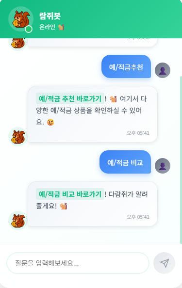

# 🐿️ finMunk

도토리를 모아 도토리 숲을, 티끌을 모아 금융을.  
금융 초보자들을 위한 올인원 금융정보 탐색 · 비교 · 추천 플랫폼

---

## ✅ 프로젝트 개요

| 항목 | 내용 |
| --- | --- |
| 프로젝트명 | finMunk |
| 설명 | 예금·적금 상품 정보 제공 및 맞춤형 추천 기능을 갖춘 통합 금융 플랫폼 |
| 기간 | 2025-05-17 ~ 2025-05-27 |
| 팀원 | 2명 (Vue3 + Django REST 기반 SPA) |

---

## 👩‍💻 팀원

| 이름 | 역할 |
| --- | --- |
| 희진 | 백엔드, 프론트엔드 컴포넌트 개발 및 통합, 기획 및 전체 구조 설계, UI/UX 설계 |
| 연주 | 프론트엔드, 백엔드, UI/UX 디자인, 컴포넌트 개발 및 통합, 추천 알고리즘, 배포 |

---

## 🧪 기술 스택

### 🔧 Backend

### 🎨 Frontend

### 🌐 API

- 금융감독원 오픈 API (정기예금/적금)  
- 한국금거래소 API (금/은 시세)  
- 유튜브 API  
- 카카오맵 API  

### 🛠️ 개발환경 & 협업 도구

  
  
  
  
  
  
  

---

## 🧩 주요 기능

| No. | 구분 | 기능 |
| --- | --- | --- |
| 1 | 사용자 인증 | 회원가입 시 나이·직업·소득·자산 입력 + dj-rest-auth Token 기반 로그인 |
| 2 | 상품 추천 | 사용자 정보 기반 추천 알고리즘 (ML + 거리 기반 유사도 계산) |
| 3 | 예·적금 비교 | 필터 및 정렬 가능한 예적금 상품 테이블 |
| 4 | 금융 시세 | 실시간 환율 계산기 + 카카오맵으로 주변 은행 검색 |
| 5 | 관심 영상 | 유튜브 영상 검색 + 저장 + 상세 요약 (GPT API 활용) |
| 6 | 마이페이지 | 추천 이력, 찜한 상품 확인 가능 |
| 7 | 커뮤니티 | 글쓰기, 댓글, 좋아요, 언급 알림 기능 포함 |

---

## 🎨 주요 기능 소개

### 홈페이지 디자인
친근한 다람쥐 캐릭터를 중심으로 깔끔하고 통일감 있는 디자인의 홈페이지를 구현했습니다. 주요 기능들을 쉽게 찾아 이용할 수 있도록 직관적인 UI/UX를 적용했으며, 챗봇 상담 기능으로 편의성을 높였습니다.

   
   
  

### 회원가입
회원가입 시 개인 정보와 함께 사용할 아이디 및 비밀번호를 설정해야 합니다.

  

### 1. AI 기반 금융 상품 추천
머신러닝 모델이 사용자의 입력 정보를 분석하여 최적의 예·적금 상품 가입 기간과 예상 금액을 제시합니다.

   
  <em>AI 분석 결과를 토대로 사용자에게 가장 적합한 TOP 5 예·적금 상품을 추천하고, 관심 있는 상품은 찜 기능을 통해 저장할 수 있습니다.</em>

  

   
   
  <em>추천된 상품의 '상세정보' 버튼을 클릭하면 상품의 세부 내용, 상담 신청 기능, 제휴 은행의 위치 정보 등을 확인할 수 있습니다.</em>

   
  <em>AI 추천 기능의 실제 동작 모습입니다.</em>

---

### 2. 예·적금 비교 및 검색
전체 금융사의 상품을 한눈에 비교하고, 원하는 조건(은행, 금리, 기간 등)으로 필터링하여 나에게 꼭 맞는 상품을 손쉽게 찾을 수 있습니다.

  

   
  <em>상품별 상세 정보 팝업을 통해 가입 조건, 금리, 우대 혜택 등을 명확하게 확인할 수 있습니다.</em>

---

### 3. 실시간 금융 정보 및 뉴스
환율, 주가 지수, 금/은 시세 등 변동성 큰 금융 정보를 실시간으로 제공합니다. 실시간 뉴스 크롤링 기능을 통해 최신 금융 뉴스를 제공하며, '더보기'를 클릭하면 해당 기사 전문을 확인할 수 있습니다.

  

  

  

---

### 4. 소통하는 금융 커뮤니티
자유롭게 금융 팁과 정보를 나누는 공간입니다. 게시글 작성, 댓글, 좋아요, @멘션 기능을 통해 다른 사용자들과 활발하게 소통하며 금융 지식을 넓혀갈 수 있습니다.

  

   
   
  <em>게시글 작성 시 카테고리를 선택하고 이미지를 첨부하면 미리보기 기능을 통해 편리하게 확인할 수 있습니다.</em>

   
  <em>댓글과 좋아요 기능으로 활발한 소통이 가능합니다.</em>

  
   
  <em>다른 사용자를 언급하거나 프로필 정보를 확인할 수 있습니다.</em>

   
  <em>프로필 보기를 누르면 상대의 팔로우 정보 등을 볼 수 있습니다.</em>

---

### 5. 유튜브 영상 검색 및 AI 요약
finMunk 플랫폼 내에서 관심 있는 금융 관련 유튜브 영상을 검색하고 개인 라이브러리에 저장할 수 있습니다. 특히, 저장한 영상의 핵심 내용을 AI(ChatGPT)가 자동으로 요약하여 학습 시간을 절약해 줍니다.

  

  

  

---

### 6. 마이페이지 및 실시간 알림
내가 찜한 상품, 좋아요한 게시글 등 모든 활동을 마이페이지에서 한눈에 관리할 수 있습니다. 또한, 나의 활동에 대한 반응과 금융 상품의 금리 변동 알림을 실시간으로 받아볼 수 있습니다.

  

  
  
  

   
  <em>알림 기능의 실제 동작 모습입니다.</em>

---

### 7. 24시간 AI 챗봇 상담
금융 관련 궁금한 점이나 필요한 기능을 AI 챗봇 '람쥐봇'과의 대화를 통해 쉽고 빠르게 안내받을 수 있습니다.

  
  

---

## 🧠 추천 알고리즘 요약

- **사용자 입력**: 나이, 직업 여부, 소득, 자산
- **머신러닝 예측**: 사전 학습된 모델이 사용자 정보 기반으로 최적 `추천 개월 수` & `추천 금액` 예측
- **유사도 계산**: 예측된 값과 DB 내 전체 상품의 (개월 수, 금액)을 `유클리드 거리`로 계산
- **최종 추천**: 거리가 가장 가까운 상위 5개 상품을 추천
- **기록 저장**: 추천 결과는 `RecommendationLog`에 저장하여 추천 이력 관리

---

## 📊 ERD Diagram

  

- 사용자(User), 금융상품(Deposit/Saving), 추천기록, 커뮤니티(Article, Comment), 저장영상, 알림(Notification) 등으로 구성
- `liked_by`는 Article, Comment, DepositProduct, SavingProduct 모두 ManyToMany 관계로 설계됨

---

## 📆 개발 일정 요약

| 날짜 | 진행 내용 |
| --- | --- |
| 5/17 | 기획 및 DB 모델 설계 |
| 5/17~20 | Django/DRF, Vue3 구조 세팅 / 상품 데이터 저장 |
| 5/21~23 | 금리 비교, 추천 알고리즘 구현 / 컴포넌트 UI 제작 |
| 5/23~25 | 영상 검색, 커뮤니티 기능 완성 / 마이페이지 연결 |
| 5/26 | 통합 테스트 및 디자인 마무리 |
| 5/27 | 발표 및 마무리 제출 |

---

## 🥲 개인 회고

### 희진

> 프로젝트 초기에는 단순히 "기능만 구현하면 되겠지"라는 마음으로 시작했지만,  
> 실제로 추천 알고리즘을 설계하고 학습시킨 모델을 API로 연결한 뒤,  
> 프론트에서 결과를 받아 렌더링하기까지의 흐름을 구현하면서  
> 하나의 서비스가 완성되기까지 필요한 단계들을 실전으로 체감할 수 있었습니다.  

> 특히 백엔드에서는 추천 모델이 예측한 결과(추천 개월 수, 금액)를 기반으로,  
> DB에 저장된 모델 입력값 구조를 잘 정의하고, 추천 결과를 API 응답 형식에 맞춰 가공하는 과정에서  
> 데이터 흐름의 중요성과 모델-서비스 간 인터페이스 설계의 실전 감각을 배울 수 있었습니다.  

> 가장 애를 먹었던 부분은 Django-rest-auth의 기본 인증 구조 커스터마이징이었습니다.  
> 처음에는 로그인 방식과 기본 필드들을 우리 서비스에 맞게 수정하려 했으나,  
> 문서가 부족하고 구조가 복잡해서 여러 번 마이그레이션을 되돌리며 시행착오를 겪었습니다.  
> 결국 완전히 원하는 방향으로 커스터마이징하지는 못했고,  
> 구조를 단순화해 일부 필드만 처리하는 방식으로 타협했지만,  
> 이 경험은 나중에 인증 로직을 보다 유연하게 설계할 수 있는 기반이 될 것이라 생각합니다.  

> 프론트(Vue)를 다루는 데에도 우여곡절이 많았습니다.  
> 특히 Vue3의 Composition API 구조에서 axios로 비동기 요청을 처리하고  
> 받은 데이터를 컴포넌트로 넘기는 흐름이 처음엔 익숙하지 않았지만,  
> API를 호출해 서버의 데이터를 직접 불러오고,  
> Vue에서 조건부 렌더링과 이벤트 핸들링을 통해 동적으로 UI를 구성하는 것을 하나씩 구현하며  
> "내 코드가 진짜 서비스로 연결된다!"는 성취감을 느낄 수 있었습니다.  

> 처음에는 하나의 .vue 파일에 많은 코드를 몰아넣다가,  
> 기능이 늘어나면서 컴포넌트를 분리하고 라우팅 구조를 명확하게 다시잡는 고생을 하며,  
> 재사용성과 유지보수성이 얼마나 중요한지를 절실히 깨달았습니다.  

> 프로젝트 막바지에는 Pinia를 활용한 상태관리와 URL 기반 API 연결도 익숙해졌고,  
> 구조를 잡는 데 점점 자신감이 생겼습니다.  

> 그리고 이번 프로젝트를 통해 사용자 경험(UX)에 대해서도 진지하게 고민해볼 수 있었습니다.  
> 단순히 기능이 잘 작동하는 것만이 아니라,  
> 사용자가 어떤 흐름으로 페이지를 탐색하고, 어떤 정보가 먼저 보여야 편한지를 계속해서 고민했습니다.  
> 예를 들어, 추천 결과나 상품 비교 페이지에서는  
> 중요한 정보가 한눈에 들어오도록 카드 구성과 정렬 기준을 반복해서 조정했고,  
> 버튼이나 알림 위치 또한 사용자 동선에 맞게 여러 번 수정했습니다.  

> 특히 마이페이지와 커뮤니티 기능에서는  
> 직관적인 피드백 제공과 정보의 시각적 배치가 얼마나 중요한지 깨달았습니다.  
> 예전에는 개발자 입장에서 "보이기만 하면 되지"라고 생각했던 요소들도,  
> 실제로 사용자가 클릭하고 탐색할 때는 반응 속도, 위치, 강조 여부가 모두 경험에 영향을 준다는 걸 실감했습니다.  

> 결과적으로 finMunk는 단순히 기능이 많은 서비스가 아니라,  
> 사용자의 흐름과 감정을 함께 고려한, '쓸만한' 서비스가 되도록 끊임없이 다듬어진 결과물이라 자신 있게 말할 수 있습니다.  

> 물론 시간이 부족해서 UI 정리나 일부 코드 리팩터링은 완벽히 마치지 못한 점은 아쉬웠지만,  
> 기획 단계에서 상상했던 서비스가 실제 화면에, 실제 데이터로 작동하는 것을 눈으로 확인했을 때  
> 그동안의 모든 고민과 고생이 보람으로 바뀌었습니다.  

> 이번 프로젝트는 단순한 코딩 과제를 넘어,  
> 하나의 제품을 기획하고 협업을 통해 완성해나가는 진짜 개발 경험이었습니다.  
> finMunk는 제게 진짜 개발자로서의 첫 실전 경험이자, 다음 단계로 도약할 수 있는 발판이 되었습니다.

---

### 연주

> 처음 Vue3를 접했을 땐 낯선 구조와 문법에 적응하는 것부터 쉽지 않았습니다.  
> 특히 Composition API 방식의 데이터 흐름이나 `ref`, `computed`, `watch` 같은 개념이 처음엔 익숙하지 않아 헤맸지만,  
> 실제로 컴포넌트를 하나하나 만들어가며 구조가 어떻게 작동하는지를 체득할 수 있었습니다.  

> 이번 프로젝트에서 프론트엔드 전반을 맡으며 가장 신경 쓴 부분은 **UI/UX의 흐름과 사용자 친화적인 인터페이스**였습니다.  
> 사용자가 어떤 화면에서 어떤 동작을 하게 될지 끊임없이 상상하면서,  
> 자연스러운 이동 흐름, 정보의 우선순위, 버튼 위치 등을 반복적으로 수정하고 개선했습니다.  

> 예를 들어, 추천 결과 페이지에서는 결과가 한눈에 들어오도록 애니메이션과 카드 레이아웃을 활용했고,  
> 예적금 비교 페이지에서는 사용자 편의성을 위해 정렬 기능, 필터 기능을 분리된 컴포넌트로 구성하여 직관적으로 다가갈 수 있도록 했습니다.  

> 마이페이지나 커뮤니티 기능에서도 사용자 경험을 고려한 시각적 배치와 피드백 제공에 집중했습니다.  
> 저장한 영상이 없을 때, 추천 이력이 없을 때 어떤 메시지를 보여줘야 할지,  
> 유저가 어떤 행동을 유도받아야 자연스러운지 고민하며 상태에 따라 화면을 다르게 구성했습니다.  

> 상태 관리는 `Pinia`를 활용해 전역적으로 사용자 정보를 관리했고,  
> 라우터와 함께 페이지 전환에 따른 흐름을 통제하는 방식도 익숙해졌습니다.  
> 특히 API 통신과 관련해 `axios`의 기본 설정과 응답 처리 구조를 통일하며 실무 감각을 익힐 수 있었습니다.  

> 또한, 다양한 기능을 담당하는 컴포넌트를 각각 나누고,  
> 반복되는 UI 요소를 재사용 가능한 컴포넌트로 만들어가며  
> Vue의 재사용성과 컴포넌트 기반 설계의 장점을 몸소 느낄 수 있었습니다.  

> 협업 측면에서는 백엔드와 API 명세를 맞추며 동기화하는 경험이 인상 깊었습니다.  
> Postman으로 요청을 테스트하고, 응답 구조가 변경될 때마다 빠르게 반영하며  
> 팀워크가 얼마나 중요한지 다시 한 번 체감했습니다.  

> 완성도를 높이기 위해 Figma로 디자인을 직접 구성하고 컴포넌트에 적용하는 과정도 인상 깊었습니다.  
> 단순히 구현하는 것이 아니라, **'사용자가 이 화면을 보고 어떻게 느낄까?'**를 계속해서 고민하며  
> 피드백을 반영하고 디자인을 다듬어 나갔습니다.  

> 물론 일정이 촉박했던 만큼 부족했던 부분도 있지만,  
> 처음 Vue를 접했을 때의 막막함에서 벗어나  
> 지금은 하나의 SPA 구조 안에서 여러 페이지를 직접 설계하고 연결할 수 있게 되었다는 점에서  
> 큰 성장을 이뤘다고 느낍니다.  

> finMunk는 단순한 프론트 개발 과제를 넘어서,  
> **사용자와 소통하는 서비스란 무엇인가**에 대해 고민하고,  
> 실질적인 결과물로 구현해낸 소중한 경험이었습니다.